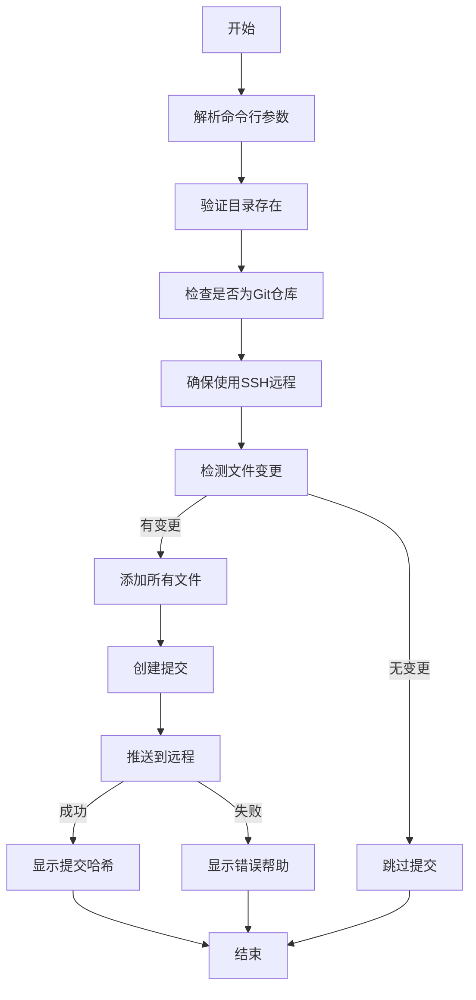

# Git 自动提交脚本

这是一个用于自动化 Git 提交和推送的 Python 脚本，特别适合用于笔记、文档或代码仓库的定期备份。

## ⚠️ 重要安全前提

**私钥必须不设置密码**：
1. 脚本要求 SSH 私钥**不能设置密码**
2. 如果您的私钥已有密码，请移除密码：
   ```bash
   ssh-keygen -p -f ~/.ssh/id_ed25519
   ```
   （提示时直接按回车两次）
3. 为什么需要这样？
   - 脚本无法处理交互式密码输入
   - 这是自动化操作的安全权衡

## 功能特性

- 📦 **自动检测变更**：仅当有文件修改时才执行提交
- ⚡ **一键操作**：自动完成添加、提交、推送全流程
- 🔄 **远程协议转换**：自动将 HTTPS 远程转换为 SSH
- 📅 **智能提交信息**：包含时间戳的自动提交消息
- 🛡️ **错误处理**：详尽的错误检测和用户友好提示
- 🖥️ **跨平台支持**：支持 Windows、Linux 和 macOS

## 使用前提

1. **Python 环境**：
   - Python 3.6 或更高版本
   - 安装路径已添加到系统 PATH

2. **Git 安装**：
   - Git 已安装并配置
   - Git 可执行文件在系统 PATH 中

3. **SSH 密钥配置**：
   - 已生成 SSH 密钥对（**私钥不设密码**）
   - 公钥已添加到 GitHub 账户
   - 测试命令：`ssh -T git@github.com` 应返回成功信息

## 脚本执行流程



## 安装与使用

### 1. 下载脚本

```bash
curl -O https://raw.githubusercontent.com/yourusername/git-auto-commit/main/git_auto_commit.py
```

### 2. 基本用法

```bash
# 使用默认目录（~/notes）和分支（main）
python git_auto_commit.py

# 指定目录和分支
python git_auto_commit.py -d "E:/my_notes" -b "master"
```

### 3. 命令行参数

| 参数       | 缩写 | 默认值    | 描述         |
| ---------- | ---- | --------- | ------------ |
| `--dir`    | `-d` | `~/notes` | Git 仓库路径 |
| `--branch` | `-b` | `main`    | 目标分支名   |

### 4. 创建快捷方式

**Windows**：
1. 创建批处理文件 `note_backup.bat`：
```batch
@echo off
python "C:\path\to\git_auto_commit.py" -d "E:\my_notes"
pause
```
2. 双击运行

**Linux/macOS**：
1. 添加到 shell 配置文件（`.bashrc` 或 `.zshrc`）：
```bash
alias note-sync="python ~/scripts/git_auto_commit.py -d ~/notes"
```
2. 运行：`note-sync`

## 安全注意事项

### 1. 私钥安全

- 🔐 **无密码私钥风险**：
  - 设备被盗时攻击者可立即访问您的仓库
  - 恶意软件可直接窃取并使用您的密钥
  
- 🛡️ **防护措施**：
  1. 仅在个人设备使用此脚本
  2. 设置全盘加密（BitLocker/FileVault）
  3. 定期轮换密钥：
     ```bash
     # 每年创建新密钥
     ssh-keygen -t ed25519 -f ~/.ssh/id_ed25519_new
     ```

### 2. 文件权限

确保正确权限设置：
```bash
chmod 700 ~/.ssh
chmod 600 ~/.ssh/id_ed25519
```

### 3. 仓库安全

- 🚫 不要在公共仓库存储敏感信息
- 🔑 使用 `.gitignore` 排除敏感文件
- 🔄 定期审查提交历史

## 故障排除

### 常见错误及解决方案：

| 错误信息                        | 解决方案                                                     |
| ------------------------------- | ------------------------------------------------------------ |
| `错误：目录不存在`              | 检查路径是否正确，使用绝对路径                               |
| `错误：不是Git仓库`             | 确保目录包含 .git 文件夹                                     |
| `推送失败`                      | 1. 运行 `ssh -T git@github.com` 测试连接<br>2. 确认私钥未设置密码 |
| `无法获取远程URL`               | 手动添加远程：`git remote add origin git@github.com:user/repo.git` |
| `Permission denied (publickey)` | 1. 确认公钥已添加到 GitHub<br>2. 检查文件权限                |

### 诊断步骤：

1. 手动测试 SSH 连接：
   ```bash
   ssh -Tv git@github.com
   ```
2. 测试 Git 操作：
   ```bash
   git add .
   git commit -m "测试"
   git push origin main
   ```

## 高级配置

### 定时自动备份

**Windows（任务计划程序）**：
1. 创建基本任务
2. 触发器：每天特定时间
3. 操作：启动程序 `pythonw.exe C:\path\to\git_auto_commit.py`

**Linux/macOS（cron）**：
```bash
# 每天23:30自动备份
30 23 * * * python /path/to/git_auto_commit.py -d ~/notes
```

### 带密码私钥的替代方案（不推荐）

如果需要使用带密码的私钥：
1. 配置 SSH 代理：
   ```bash
   eval "$(ssh-agent -s)"
   ssh-add ~/.ssh/id_ed25519  # 输入密码
   ```
2. 在代理会话期间运行脚本
3. 注意：这会降低自动化程度

## 示例输出

```
检测到文件变更，正在提交 E:/notes 到分支 main...
已将远程URL更改为SSH: git@github.com:username/notes.git
✅ 提交成功！最新版本: a1b2c3d
```

```
没有检测到文件变更，跳过提交
```

```
推送失败，请检查以下配置：
1. 确保已添加SSH密钥到GitHub
2. 确认私钥未设置密码
3. 测试SSH连接: ssh -T git@github.com
4. 手动推送一次: git push origin main
```

## 贡献与反馈

欢迎提交问题和改进建议：
- [问题报告](https://github.com/yourusername/git-auto-commit/issues)
- [拉取请求](https://github.com/yourusername/git-auto-commit/pulls)

## 许可证

MIT 许可证 - 自由使用、修改和分发

---

这个更新版本的 README 特别强调了私钥不能设置密码的重要前提，并在安全注意事项部分详细解释了相关风险和防护措施。同时保留了所有使用说明和故障排除指南，确保用户能安全有效地使用脚本。